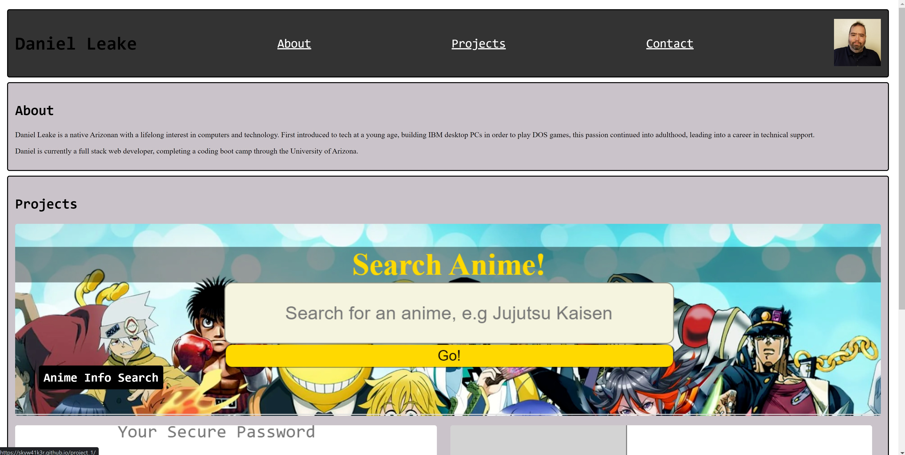

# Portfolio-Update-1

## Description

This project is an update to the previously created portfolio, to include links to the first major group project, LinkedIn, and a professional resume. This project coincides with updating my LinkedIn profile and pinnning notable projects on Github.

## Installation

Portfolio may be accessed through the following URL: https://rensyphon.github.io/Portfolio-Update-1/

## Usage

Access at https://rensyphon.github.io/Portfolio-Update-1/v.

    ```md
    
    ```

    ```

## Credits

Icons taken from Font Awesome (https://fontawesome.com/).

Code taken from https://github.com/rensyphon/DANIEL-LEAKE-PORTFOLIO.